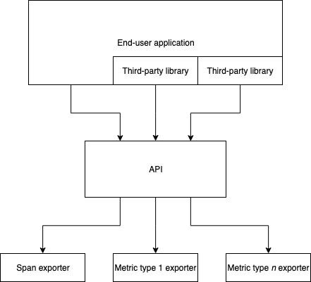

# Implement SDK as an exporter

Invert the exporter and SDK architecture such that the SDK becomes an exporter itself

## Motivation

* Addresses user concerns, e.g., https://github.com/open-telemetry/opentelemetry-go/issues/23#issuecomment-505667583
* Increases surface area that can be shared across vendors
* ...

## Explanation

This RFC proposes that the OpenTelemetry API follow the following architecture:



This is a substantial departure from the [current architecture](https://github.com/open-telemetry/opentelemetry-specification/blob/master/specification/language-library-design.png). In particular:

* The API adopts a concrete implementation, rather than an abstract interface with different implementations including the SDK, a minimimal implementation, vendor-specific implementations, etc.
* The API sends data **directly** to exporters, rather than the SDK sending data to exporters
* The API **does not directly manage any state**

**Exporters** are then proposed as follows:

* Specific to a particular data type, e.g., `SpanExporter`, `MeasureExporter`
* Default to no-op behaviour; i.e., if the user does not provide an exporter for a particular data type, nothing should hold onto the data once it has been exported
  * The particular implementation of this may be language-specific, e.g., [null object pattern](https://en.wikipedia.org/wiki/Null_object_pattern) vs an optional object
* **Composable**

For example, the API may export spans through a `SpanExporter` such as:

```go
type SpanExporter interface {
	ExportSpan(Span)
}
```

A `FileSpanExporter` could then be implemented on top of a common, "building-block" `NonBlockingSpanExporter` as follows:

```go
type NonBlockingSpanExporter struct {
	lock     *sync.RWMutex
	exporter SpanExporter
}

func NewNonBlockingSpanExporter(wrappedExporter SpanExporter) NonBlockingSpanExporter {
	return NonBlockingSpanExporter{
		lock:     &sync.RWMutex{},
		exporter: wrappedExporter,
	}
}

func (e NonBlockingSpanExporter) ExportSpan(span Span) {
	e.lock.RLock()

	go func() {
		e.exporter.ExportSpan(span)

		e.lock.RUnlock()
	}()
}

func (e *NonBlockingSpanExporter) Close(ctx context.Context) error {
	e.lock.Lock()
	defer e.lock.Unlock()

	e.exporter = NoopSpanExporter{}

	return nil
}

type FileExporter struct {
	exporter trace.NonBlockingSpanExporter
}

func NewFileExporter(opts ...Option) FileExporter {
	c := newConfig(opts...)
	e := exporter{
		encoder:      json.NewEncoder(c.file),
		errorHandler: c.errorHandler,
	}

	return FileExporter{
		exporter: trace.NewNonBlockingSpanExporter(e),
	}
}

func (e FileExporter) ExportSpan(span trace.Span) {
	e.exporter.ExportSpan(span)
}

func (e FileExporter) Close(ctx context.Context) error {
	return e.exporter.Close(ctx)
}

type exporter struct {
	// internals
}

func (e exporter) ExportSpan(span trace.Span) {
	// write span to a file
}
```

In particular, the SDK itself becomes an exporter. Please see the section on [internal details](#internal-details) for more.

## Internal details

From a technical perspective, how do you propose accomplishing the proposal? In particular, please explain:

* How the change would impact and interact with existing functionality
* Likely error modes (and how to handle them)
* Corner cases (and how to handle them)

While you do not need to prescribe a particular implementation - indeed, RFCs should be about **behaviour**, not implementation! - it may be useful to provide at least one suggestion as to how the proposal *could* be implemented. This helps reassure reviewers that implementation is at least possible, and often helps them inspire them to think more deeply about trade-offs, alternatives, etc.

## Trade-offs and mitigations

What are some (known!) drawbacks? What are some ways that they might be mitigated?

Note that mitigations do not need to be complete *solutions*, and that they do not need to be accomplished directly through your proposal. A suggested mitigation may even warrant its own RFC!

## Prior art and alternatives

What are some prior and/or alternative approaches? For instance, is there a corresponding feature in OpenTracing or OpenCensus? What are some ideas that you have rejected?

## Open questions

What are some questions that you know aren't resolved yet by the RFC? These may be questions that could be answered through further discussion, implementation experiments, or anything else that the future may bring.

## Future possibilities

What are some future changes that this proposal would enable?

